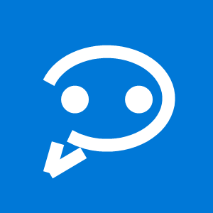

# WpBlueBubbles

WpBlueBubbles is an unofficial, native classic UWP client for connecting Windows
10 Mobile and Windows PCs to a [BlueBubbles](https://bluebubbles.app/) server.
It brings a Microsoft Messenger-inspired interface to Windows Phone while using
the same C#/XAML application package on desktop Windows.

> **Beta software:** This project can send messages and perform destructive chat
> actions. Keep a current BlueBubbles server backup and read confirmation dialogs.

## Features

- Native classic UWP C#/XAML interface for Windows 10 Mobile and Windows 10 PCs.
- QR camera or manual server setup, with credentials stored in PasswordVault.
- Chat list, search, archived-chat filtering, message history, and foreground sync.
- Send and receive text, photos, videos, and general file attachments.
- Contact names and photos from the local People database.
- Group names, group photos, multi-recipient composition, rename, leave, and delete.
- Configurable Messenger-blue or Windows accent styling with an OLED-black mode.
- Group sender labels and full-screen picture viewing.
- Read/unread state, mark-as-read, and typing indicators when Private API is ready.
- Share target, contact activation, media saving, and per-chat Start tiles.

Notifications and Live Tile updates are intentionally disabled in the current
beta. The proposed WNS notification architecture is documented in
[docs/notifications-v0.3-plan.md](docs/notifications-v0.3-plan.md).

## Requirements

- A working BlueBubbles server and its server password.
- Windows 10 Mobile or Windows 10 build 15063 or newer.
- ARM for Lumia; x86 or x64 for Windows PCs.
- The included `CN=retiredlake` certificate and architecture dependencies for
  sideloading a release build.
- BlueBubbles Private API enabled **and** its helper connected for availability,
  typing, server-side read state, group creation/rename/leave, and deletion.

## Install A Release

1. Download the ZIP for the desired beta from GitHub Releases and extract it.
2. On Windows PC, right-click `Install.ps1` and choose **Run with PowerShell**.
3. On Lumia, trust `01-Trust-retiredlake.cer`, install every package from
   `Dependencies\arm`, then install the `.appxbundle`.
4. Launch BlueBubbles Beta and enter the server URL/password or scan its setup QR.

Release ZIPs contain one complete `WpBlueBubbles_<version>_Test` folder. Keep its
`Dependencies` directory beside the bundle. See [PATCH_NOTES.md](PATCH_NOTES.md)
before choosing an older legacy build.

## Build From Source

1. Install Visual Studio 2019 with **Universal Windows Platform development**.
2. Install Windows 10 SDK 10.0.19041 and the SDK components required by the
   classic UWP toolchain. No emulator is required or supported by this project.
3. Open `WpBlueBubbles.sln`.
4. Restore NuGet packages, including Microsoft.UI.Xaml 2.7.3.
5. Build `Release` for `ARM`, `x86`, or `x64`.

The project targets `Windows.Universal` with MinVersion `10.0.15063.0`. Lumia
testing should be performed on real hardware.

## API Scope

The client currently uses BlueBubbles REST endpoints for server metadata, chat
and message queries, text/media sending, attachment downloads, chat creation,
availability, read state, group actions, and deletion. A minimal Socket.IO path
is used to stop typing because BlueBubbles Server 1.9.9 has a defective HTTP
stop-typing handler.

The app does **not** implement edit, unsend, message scheduling, reactions, or
other modern iMessage-only features. Supporting older iMessage, RCS, and SMS
clients takes priority until notifications are complete.

## Privacy And Safety

- No server address or password is included in source control or release notes.
- Credentials stay in the local Windows PasswordVault.
- Tests must never send to or delete from a live server without explicit consent.
- Rename, leave, delete, and new-group operations are capability-gated and require
  user action or confirmation.

## Status

The current release is **v0.2.1.8 Beta**. Builds from v0.1.6.0 through v0.1.9.9
are published as legacy betas for testing and historical preservation.

The v0.2 series stores growing per-chat state in files rather than the
size-limited application settings container. v0.2.1.0 adds immediate OLED and
accent theming, clearer server/settings details, sender labels for group
messages, full-screen picture viewing, and contact-photo conversation tiles.
v0.2.1.5 adds a denser phone layout, local-only unread tracking, reliable video
loading, multi-file sharing, improved offline errors, and device-aware Enter behavior.
v0.2.1.6 restores gray incoming bubbles, improves keyboard anchoring and compact
secondary-page headers, and performs a deeper reset. v0.2.1.7 restores the
pre-v0.2.1.5 on-demand media path, adds safe read retries, and allows setup to
complete even when the first chat sync needs to retry.
v0.2.1.8 restores nonblocking image rendering through lazy authenticated
downloads, adds configurable polling, corrects desktop Enter behavior, and
keeps desktop conversation actions visible.

Developed by [retiredlake.com](https://retiredlake.com/).

## License

Licensed under the [Apache License 2.0](LICENSE).

BlueBubbles and iMessage are names belonging to their respective owners. This
project is community-developed and is not affiliated with Apple or Microsoft.
